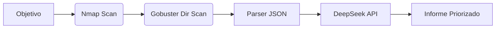

# 01 - Arquitectura de recon-ai-suite

## 🎯 Objetivo

Automatizar el reconocimiento de un pentest autorizado y reducir el tiempo entre
"tengo la salida de nmap" y "tengo un informe priorizado y entregable".

El sistema es un **pipeline lineal de 5 etapas**: cada etapa consume el artefacto
de la anterior, y ninguno de los pasos intermedios se salta.

## 🗺️ Diagrama de flujo



> La notación distingue: `[ ]` = datos/artefactos y `( )` = procesos ejecutables.
> El grafo es **LR (izquierda a derecha)** porque el pipeline es secuencial:
> no hay bifurcaciones ni bucles, sólo una cadena de dependencias.

## 🧩 Explicación de cada componente

### A. Objetivo (`[Objetivo]`)

- **Qué es**: la IP o el dominio autorizado que se va a reconocer.
- **Dónde vive**: `config.yaml` (`target.domain` / `target.ip`) o el flag
  `--target` de cualquiera de las fases.
- **Por qué existe**: es el **único punto de entrada** del sistema; de él derivan
  el nombre de todos los artefactos (`nmap_<target>.xml`, `<target>.json`,
  `<target>_<timestamp>.md`), lo que da trazabilidad completa entre evidencia
  cruda, análisis y entrega.
- **Entrada**: cadena `IP|dominio`. **Salida**: la misma cadena normalizada (slug).

### B. Nmap Scan (`(Nmap Scan)`)

- **Qué hace**: escaneo de puertos, detección de versiones, scripts NSE y huella
  de SO (`-sV -sC -T4 --top-ports 1000` por defecto).
- **Módulo**: `src/scanner.py` (clase `Scanner`, método `nmap()`), usando la
  librería **`python-nmap`** (`nmap.PortScanner`).
- **Por qué existe**: es la **fuente de verdad del inventario de superficie de
  ataque**. Sin puertos y servicios no hay nada que priorizar ni reportar; además
  determina si la etapa C tiene sentido (si no hay HTTP/HTTPS, gobuster no aporta).
- **Salida**: `evidencia/raw/nmap_<target>.xml` (XML de nmap, formato estable y
  parseable, en lugar del texto libre de consola).
- **Modo de fallo**: si el binario `nmap` no está instalado, se lanza un error
  claro y la fase termina con código 1 (no se genera JSON vacío silenciosamente).
  Si `python-nmap` no está disponible, hay *fallback* a `subprocess`.

### C. Gobuster Dir Scan (`(Gobuster Dir Scan)`)

- **Qué hace**: enumeración de directorios y ficheros en los servicios web
  detectados en B (`gobuster dir -u http://<target> -w <wordlist>`).
- **Módulo**: `src/scanner.py` (método `gobuster()`), vía `subprocess` porque
  gobuster es una herramienta Go sin API Python estable.
- **Por qué existe**: nmap responde "hay un Apache 2.4.41"; no responde "existe
  `/backup.zip` y `/server-status`". Ese contenido es el que suele convertirse en
  hallazgo real de severidad media/alta.
- **Dependencia de orden**: se ejecuta **después** de B porque necesita un puerto
  HTTP vivo; en `config.yaml` está deshabilitado por defecto (`enabled: false`)
  para no lanzar fuerza bruta de rutas sin wordlist ni permiso explícito.
- **Salida**: `evidencia/raw/gobuster_<target>.txt`.

### D. Parser JSON (`[Parser JSON]`)

- **Qué hace**: convierte la evidencia cruda en un **documento JSON único y
  normalizado** (`hosts`, `ports`, `web_paths`, `findings`) y añade una severidad
  sugerida mediante las tablas `SEVERITY_BY_PORT` y `SERVICE_RECOMMENDATIONS`.
- **Módulo**: `src/parser.py` (usa `xml.etree.ElementTree` de la stdlib).
- **Por qué existe**: es la **capa anticorrupción** del sistema. Tres razones:
  1. Desacopla las herramientas (que cambian de flags y formato) del análisis.
  2. Establece un contrato estable: se puede repetir la IA o el informe sin
     volver a escanear el objetivo.
  3. Reduce el ruido: enviar un XML de 500 líneas al LLM es caro e impreciso;
     enviar 10 hallazgos compactos es barato y determinista.
- **Salida**: `evidencia/parsed/<target>.json`.

### E. DeepSeek API (`[DeepSeek API]`)

- **Qué hace**: recibe los hallazgos ya compactados y devuelve, por cada uno, una
  severidad final, el riesgo real en lenguaje natural, la remediación y la técnica
  MITRE ATT&CK asociada; además de un resumen ejecutivo y próximos pasos.
- **Módulo**: `src/ai_prioritizer.py`. Vía principal: SDK **`openai`** apuntando a
  `api.base_url` (`https://api.deepseek.com`), ya que DeepSeek expone una API
  compatible con OpenAI; se pide salida JSON estricta
  (`response_format={"type": "json_object"}`). Respaldo: `requests` si el SDK no
  está instalado.
- **Por qué existe**: el parser sólo conoce reglas fijas (puerto → severidad). El
  riesgo real depende del contexto: un `3389/tcp` en una red interna segmentada no
  es lo mismo que expuesto a Internet, y un `/backup.zip` accesible suele ser más
  grave que un banner SSH. El LLM aporta ese juicio contextual y lo traduce a
  lenguaje de negocio para el informe.
- **Por qué no bloquea el pipeline**: si falta `DEEPSEEK_API_KEY` o la API falla,
  se aplica `heuristic_prioritization()` (tablas locales del parser) y el hallazgo
  queda marcado con `engine: heuristic`. Así el pipeline **siempre entrega**, y
  `--no-ai` permite trabajar en clientes que prohíben enviar datos a terceros.
- **Garantías de coste/privacidad**: sólo se envían los campos compactos del
  hallazgo (`id`, `title`, `host`, `evidence`, `severity_hint`), nunca la evidencia
  cruda completa ni datos fuera del alcance.

### F. Informe Priorizado (`[Informe Priorizado]`)

- **Qué hace**: renderiza el documento final en Markdown con resumen ejecutivo,
  métricas, hallazgos ordenados por severidad, inventario técnico, superficie web y
  próximos pasos.
- **Módulo**: `src/report_generator.py`, usando **Jinja2** (`jinja2.Template`) para
  separar la plantilla de presentación de los datos.
- **Por qué existe**: es el producto entregable; el valor del pipeline sólo se
  materializa cuando el cliente recibe un informe legible. Jinja2 permite cambiar
  el formato (Markdown, HTML, PDF) o el idioma tocando la plantilla, sin modificar
  la lógica de recolección ni de priorización.
- **Salida**: `evidencia/reportes/<target>_<YYYYmmdd-HHMMSS>.md` (o la ruta indicada
  con `--out`).

## 🧾 Mapa componente ↔ módulo ↔ dependencia

| Nodo del diagrama | Módulo | Dependencia clave | Artefacto |
|---|---|---|---|
| `[Objetivo]` | `config.yaml` / `--target` | PyYAML | cadena target |
| `(Nmap Scan)` | `src/scanner.py::Scanner.nmap` | **python-nmap** (+ `subprocess` de respaldo) | `raw/nmap_<target>.xml` |
| `(Gobuster Dir Scan)` | `src/scanner.py::Scanner.gobuster` | `subprocess` + binario gobuster | `raw/gobuster_<target>.txt` |
| `[Parser JSON]` | `src/parser.py` | `xml.etree` + `re` (stdlib) | `parsed/<target>.json` |
| `[DeepSeek API]` | `src/ai_prioritizer.py` | **openai** (+ **requests** de respaldo) | `parsed/<target>_priorizado.json` |
| `[Informe Priorizado]` | `src/report_generator.py` | **Jinja2** | `reportes/<target>_<fecha>.md` |
| Orquestación | `scripts/run_recon.sh` | bash | log + exit code |

## 🔄 Flujo de datos entre etapas

```
[Objetivo]  ──▶ (Nmap Scan) ──▶ raw/nmap_<target>.xml ──┐
                                                        ▼
                             (Gobuster Dir Scan) ──▶ [Parser JSON]
                                    │                    │
                     raw/gobuster_<target>.txt ──────────┘
                                                         │
                                                         ▼
                                          parsed/<target>.json
                                                         │
                                                         ▼
                                             [DeepSeek API]  (o heurística)
                                                         │
                                                         ▼
                                      parsed/<target>_priorizado.json
                                                         │
                                                         ▼
                                          [Informe Priorizado] → reportes/*.md
```

## 📜 Contrato JSON (salida del parser)

```json
{
  "generated_at": "2026-01-01T12:00:00+00:00",
  "target": "192.168.56.10",
  "summary": { "hosts_up": 1, "open_ports": 5, "web_paths": 4 },
  "hosts": [
    {
      "ip": "192.168.56.10",
      "hostname": "victima.local",
      "os": "Linux 5.4 - 5.15",
      "ports": [
        { "port": 23, "protocol": "tcp", "state": "open", "service": "telnet",
          "product": "Linux telnetd", "version": "", "scripts": [] }
      ]
    }
  ],
  "web_paths": [ { "path": "/backup.zip", "status": "200", "size": 10485760 } ],
  "findings": [
    { "id": "PORT-23/tcp", "source": "nmap", "host": "192.168.56.10",
      "title": "Servicio expuesto: telnet en 23/tcp", "severity_hint": "alta",
      "evidence": "Linux telnetd", "recommendation": "Deshabilitar y migrar a SSH." }
  ]
}
```

El documento priorizado añade `engine`, `counts_by_severity`, `executive_summary`,
`next_steps` y, por hallazgo, `severity` final, `explanation` y `mitre_technique`.

## 🧱 Decisiones de diseño

1. **Pipeline lineal y reproducible**: cada etapa es un proceso independiente
   (`python -m src.<fase>`) que se puede re-ejecutar sin repetir las anteriores,
   porque la evidencia de cada fase queda persistida en su propio directorio.
2. **Contrato JSON estable**: `parser.py` define el esquema; la IA y el informe sólo
   consumen ese formato. Cambiar de proveedor LLM no obliga a tocar el resto.
3. **Fallback determinista**: la priorización nunca bloquea la entrega; sin API key
   se usa la tabla `SEVERITY_BY_PORT`/`SERVICE_RECOMMENDATIONS` del parser.
4. **Doble vía tecnológica donde aporta valor**: `python-nmap` como vía principal
   (API estructurada) con `subprocess` de respaldo; `openai` como cliente principal
   con `requests` de respaldo. Degradar es preferible a fallar.
5. **Presentación separada de los datos**: Jinja2 renderiza el informe, de modo que
   cambio de formato o idioma no toca la lógica del pipeline.
6. **Secretos fuera del repositorio**: `config.yaml` sólo guarda el *nombre* de la
   variable de entorno (`api.api_key_env`); la key nunca se escribe en disco.

## 🔐 Consideraciones de seguridad

- Ejecutar nmap con `-T4` y `--top-ports` para no saturar el objetivo; el timeout de
  `config.yaml` se traduce en `--host-timeout` al usar `python-nmap`.
- Registrar siempre el comando exacto ejecutado (`ScanResult.command_line`) para
  trazabilidad del alcance autorizado.
- Tratar `evidencia/` como material sensible: contiene la huella del objetivo.
- La priorización con IA sólo envía campos compactos del hallazgo, nunca la
  evidencia cruda; `--no-ai` permite modo 100% local.

## 🚧 Limitaciones conocidas

- La conversión a PDF está pendiente: `report.format: pdf` requiere pandoc o
  weasyprint (Jinja2 ya deja el HTML/Markdown listo para esa fase).
- `gobuster` requiere una wordlist válida en `config.yaml` y un servicio HTTP vivo.
- No hay paralelización entre fases ni reintentos con *backoff* en la llamada al LLM.
